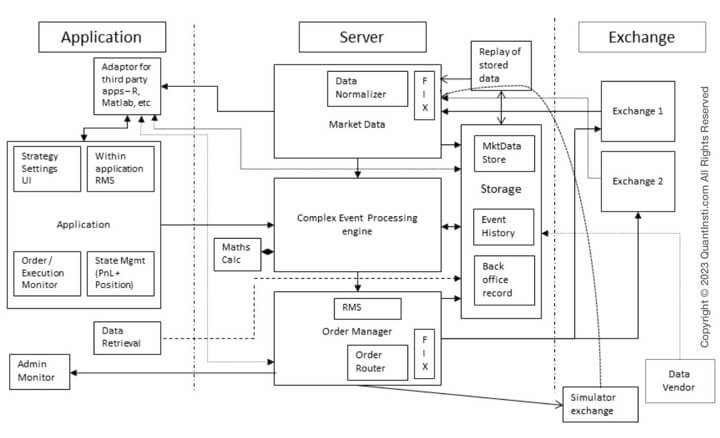
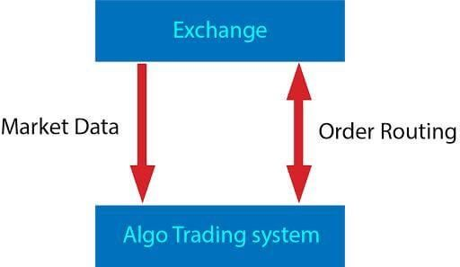
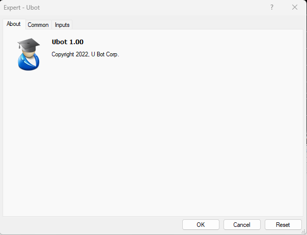
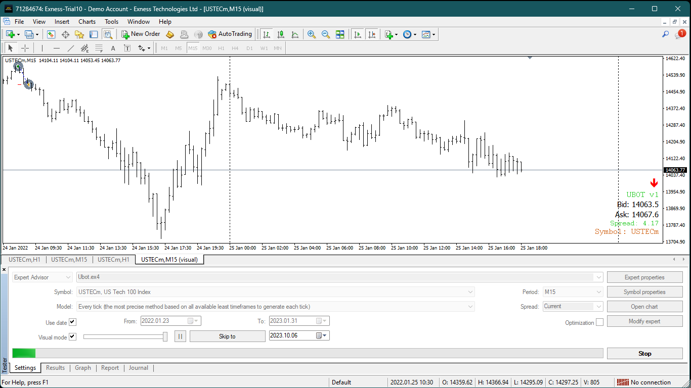
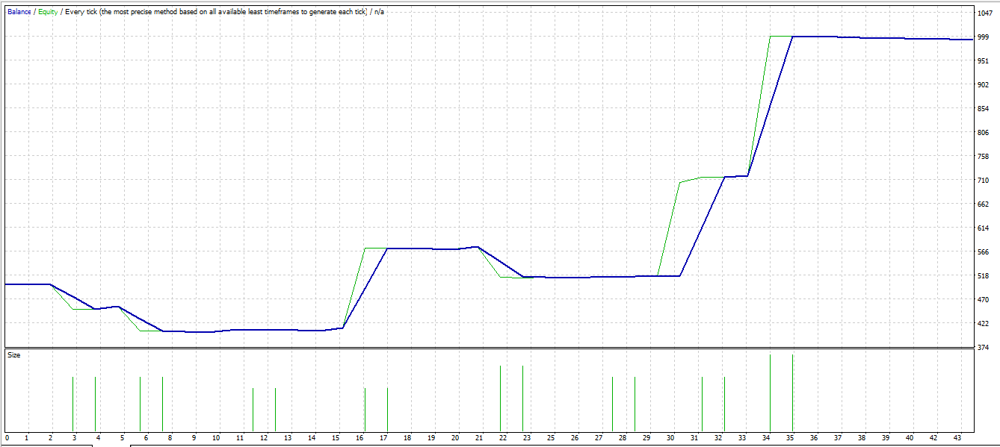
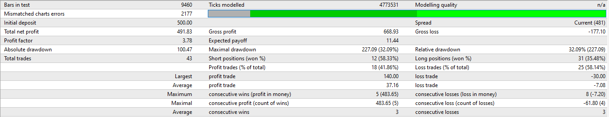

<a name="readme-top"></a>

<!-- PROJECT LOGO -->
<br />
<div align="center">
  <a href="https://github.com/kudzaiprichard/realestate-backend">
    
  </a>

  <h3 align="center">UBot `Expert System`</h3>

  <p align="center">
    A meta trader 4 trading bot 
    <br />
  </p>
  <br/>
</div>

<!-- TABLE OF CONTENTS -->
<details>
  <summary>Table of Contents</summary>
  <ol>
    <li>
      <a href="#about-the-project">About The Project</a>
      <ul>
        <li><a href="#project-scope">Project Scope</a></li>
        <li><a href="#project-design">Project Design</a></li>
        <li><a href="#built-with">Built With</a></li>
      </ul>
    </li>
    <li>
      <a href="#getting-started">Getting Started</a>
      <ul>
        <li><a href="#prerequisites">Prerequisites</a></li>
        <li><a href="#installation">Installation</a></li>
        <li><a href="#usage">Usage</a></li>
        <li><a href="#contributing">Contributing</a></li>
      </ul>
    </li>
    <li><a href="#license">License</a></li>
    <li><a href="#contact">Contact</a></li>
    <li><a href="#acknowledgments">Acknowledgments</a></li>
  </ol>
</details>

<!-- ABOUT THE PROJECT -->
# About The Project

### Project Scope

An automated trading system (ATS), a subset of algorithmic trading, uses a computer program to create buy and sell orders 
and automatically submits the orders to a market center or exchange.The computer program will automatically generate orders 
based on predefined set of rules using a trading strategy which is based on technical analysis, advanced statistical 
and mathematical computations or input from other electronic sources.


* Should allow users to input parameter properties like stop loss and take profit etc.
* Expert system should be able to automatically open trades, manage, scale trades and manage trades. 
* Trading bot must also be able to manage trades in terms of trailing profit, scaling position, maintaining long and short trading

## Project Design

### Architecture

<div align="center"> 
 
</div>

Taking all above into consideration, the traditional architecture of the entire 
automated trading system can now be broken down into:

`The exchange(s)` – the external world

`The server`
* Receives market data
* Stores the market data
* Store orders generated by the user

`Application`
* Takes inputs from the user initially for the decisions such as stop loss, limits, the preferred financial instrument for trading etc.
* Acts as an interface for viewing the information including the data and orders
* Acts as an order manager sending orders to the exchange

<div align="center"> 
 
</div>

The `market data`, that is received, typically `informs` the automated trading system of the latest order book.
It may also contain some additional information like the `volume traded` so far, the last traded price, 
and the quantity of the `trading order`. However, to make a `decision based on the data`, the automated system looks at
the old values or `derives certain patterns` from the history. Based on this historical analysis of data and patterns, 
the system goes forward to create a `trading strategy` and execute the same.

Last but not least, a GUI interface is needed for the trader to view all this information on a screen.

### Built With
System was written in `Meta Quotes 4`, language that is supported by `Meta trader 4`:  

<div>
    
</div>

<p align="right">(<a href="#readme-top">back to top</a>)</p>

<!-- GETTING STARTED -->
## Getting Started

### Prerequisites

You should have the below software installed in your pc :
* Meta Trader 3
* Meta Quotes 3
* and your preferred IDE or text editor

### Installation

1. Get a free API Key at [https://github.com/settings/tokens](https://github.com/settings/tokens)
2. Clone the repo

   ```sh
   git clone https://github.com/kudzaiprichard/ubot-mt4
   ```
3. Inside meta editor click on `file`, and choose `open data folder`

4. `Open mql4 folder`, and copy `Experts/ ubot` mql4 source file to `Experts folder`

5. Copy `Include/Ubot` folder to include folder

6. Copy `indicators/Ubot` folder to indicators folder

7. Close and `open meta editor` then open `ubot mql4 source file` and `run it`

   > NB: An `ubot complied ex4` file program will be created

8. The same complied `ubot ex4 file` will appear in `meta trader 4`

   > NB: Use that complied `ubot file` to run your bot on the market or test it in `mt4 strategy tester`


### Usage
1. Open meta trader 4
2. Drag and drop the bot in desired chart to run the bot
3. The following bot `interface` will show 

    <div align="center">
        <br/>
        
    </div>
   
4. Double tap on the `Inputs` tab

    <div align="center">
        <br/>
        
    </div>

5. Enter desired `inputs settings` for your bot or import settings and press `ok` button
6. The bot will then run and will display the interface screen when running successfully
    
   <div align="center">
        <br/>
        
    </div>
   
> NOTE: Bot should display that dashboard at the far right bottom corner

### Results
Below is the UML design of the system including relationships between the difference objects that make up the system




<p align="right">(<a href="#readme-top">back to top</a>)</p>


<!--CONTRIBUTING-->
## Contributing

If you have a suggestion that would make this better, please fork the repo and create a pull request. You can also simply open an issue with the tag "enhancement".
Don't forget to give the project a star! Thanks again!

1. Fork the Project
2. Create your Feature Branch (`git checkout -b feature/AmazingFeature`)
3. Commit your Changes (`git commit -m 'Add some AmazingFeature'`)
4. Push to the Branch (`git push origin feature/AmazingFeature`)
5. Open a Pull Request

### :fire: Contribution

 Your contributions are always welcome and appreciated. Following are the things you can do to contribute to this project.

 1. **Report a bug** <br>
 If you think you have encountered a bug, and I should know about it, feel free to report it [here]() and I will take care of it.

 2. **Request a feature** <br>
 You can also request for a feature [here](), and if it will viable, it will be picked for development.  

 3. **Create a pull request** <br>
 It can't get better than this, your pull request will be appreciated by the community. You can get started by picking up any open issues from [here]() and make a pull request.

 > If you are new to open-source, make sure to check read more about it [here](https://www.digitalocean.com/community/tutorial_series/an-introduction-to-open-source) and learn more about creating a pull request [here](https://www.digitalocean.com/community/tutorials/how-to-create-a-pull-request-on-github).

<p align="right">(<a href="#readme-top">back to top</a>)</p>


<!-- LICENSE -->
## License

> Distributed under the MIT License. See `LICENSE.txt` for more information.

<p align="right">(<a href="#readme-top">back to top</a>)</p>


<!-- CONTACT -->
## Contact

> Kudzai P Matizirofa - [linkedin.com/in/kudzai-prichard](https://linkedin.com/in/kudzai-prichard) - <kudzaiprichard@gmail.com>

Project Link: [https://github.com/kudzaiprichard/ubot-mt4](https://github.com/kudzaiprichard/ubot-mt4)

<p align="right">(<a href="#readme-top">back to top</a>)</p>

<!-- ACKNOWLEDGMENTS -->
## Acknowledgments

list of resources I found helpful and would like to give credit to.

* [Choose an Open Source License](https://choosealicense.com)
* [What are Expert Advisors](https://www.ig.com/en/trading-strategies/expert-advisors-explained-190312#:~:text=Expert%20Advisors%20(EAs)%20are%20programs,or%20open%20a%20position%20automatically)
* [Getting Started With MT4](https://www.metatrader4.com/en/trading-platform/help/userguide/open_an_account)
* [Meta Quotes docs](https://docs.mql4.com/)
* [GitHub Pages](https://pages.github.com)
<p align="right">(<a href="#readme-top">back to top</a>)</p>

